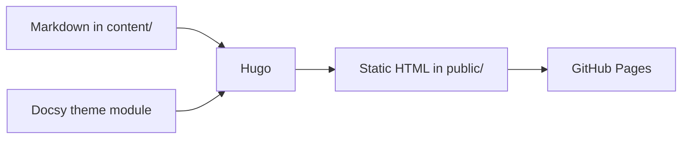
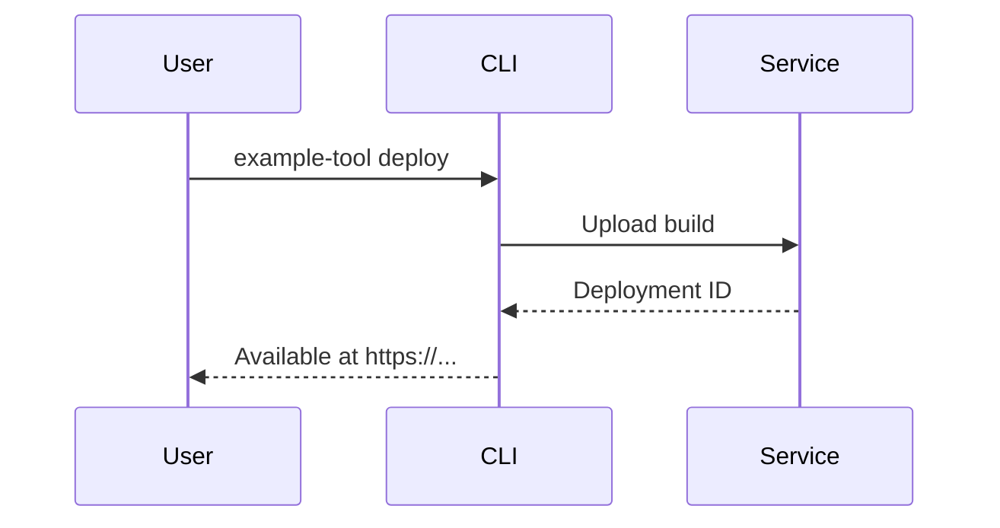

Fenced `mermaid` blocks render as diagrams, so they live in version control as text.

## Flowchart

```mermaid
flowchart LR
    A[Markdown in content/] --> B[Hugo]
    C[Docsy theme module] --> B
    B --> D[Static HTML in public/]
    D --> E[GitHub Pages]
```

## Sequence diagram

```mermaid
sequenceDiagram
    participant U as User
    participant C as CLI
    participant S as Service
    U->>C: example-tool deploy
    C->>S: Upload build
    S-->>C: Deployment ID
    C-->>U: Available at https://...
```
